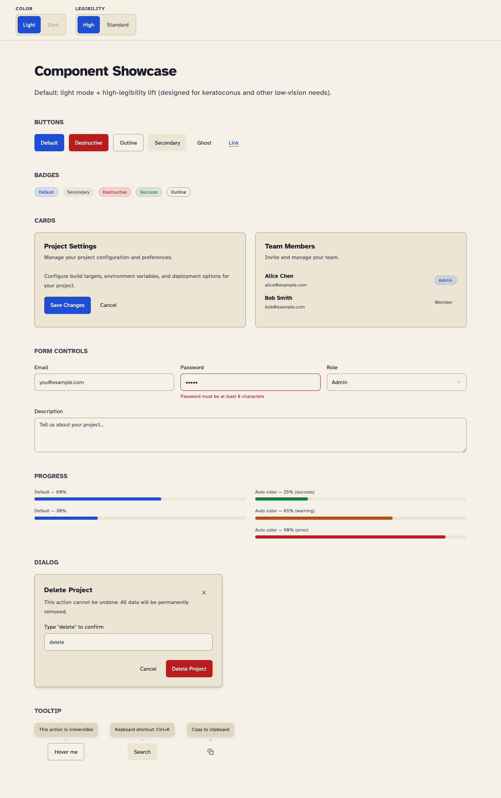
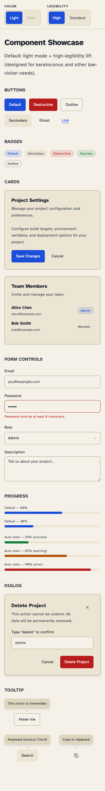
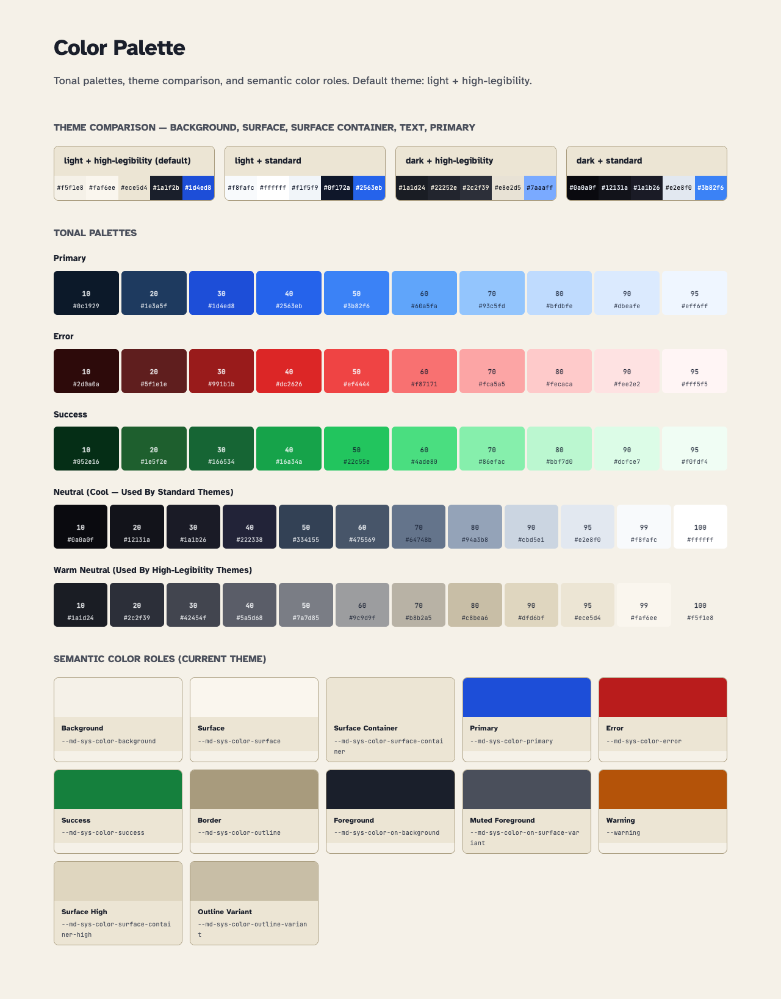

# Design System

Cross-project design system inspired by Material Design 3's architecture, with a high-legibility default tuned for keratoconus and other low-vision needs.



## Quick Start

```bash
npm install
npm run build          # Generate platform outputs from tokens
npm test               # Verify token build + WCAG contrast
```

## Theme Matrix

The system has **two orthogonal axes**: color (light/dark) and legibility (high/standard). They compose freely, giving four valid combinations.

| Selector on `<html>`                         | Color | Legibility | Use case                                  |
| -------------------------------------------- | ----- | ---------- | ----------------------------------------- |
| _(none — `:root` default)_                   | light | high       | New default — best for low-vision readers |
| `.dark`                                      | dark  | high       | Dark color theme, KC lifts still on       |
| `.standard-legibility`                       | light | standard   | Light, but no KC lifts                    |
| `.dark.standard-legibility`                  | dark  | standard   | Restores the pre-0.2.0 look exactly       |

`data-theme="dark"` and `data-a11y="standard"` are equivalent if you can't add classes.

```html
<!-- Default (best for everyone, especially KC) -->
<html>

<!-- Dark theme, KC lifts still apply -->
<html class="dark">

<!-- Restore the pre-0.2.0 dark aesthetic exactly -->
<html class="dark standard-legibility">
```

## Migrating from 0.1.x

The default look has changed: previously dark + standard, now light + high-legibility. **Existing projects will look different on first load.**

To restore the prior aesthetic without code changes, add two classes to your `<html>`:

```html
<html class="dark standard-legibility">
```

Backward-compatible alias variables (`--primary`, `--background`, `--border`, etc.) all still work — they just resolve to the new defaults.

## Accessibility — High-Legibility Mode

High-legibility mode is designed around symptoms commonly reported in **keratoconus** (corneal thinning that causes ghosting, halos, glare, and reduced letter recognition), but it benefits a much wider audience: **dyslexia, low vision, post-LASIK recovery, migraine, and aging eyes**.

What it changes:

| Concern                                 | Lift                                                                   |
| --------------------------------------- | ---------------------------------------------------------------------- |
| Glare / halos around bright text        | Warm off-white bg `#f5f1e8` (not `#ffffff`); dark slate text (not `#000`) |
| Letter ghosting on standard fonts       | Atkinson Hyperlegible font (designed for low vision), Inter fallback   |
| Thin strokes hard to resolve            | Body weight 500, headings 700 (vs 400 / 600)                           |
| Words running together on long lines    | Body line-height 1.7 (vs 1.5), letter-spacing +0.01em                  |
| Touch targets too small for shaky aim   | Minimum 44px on buttons, inputs, selects                               |
| Motion sensitivity                      | Transitions capped to 100ms linear; honors `prefers-reduced-motion`    |

To opt out per-page, set `class="standard-legibility"` on `<html>`.

## Mobile Support

Tested down to **320px viewport width**. The showcase, palette, and React components all reflow without horizontal scroll. Touch targets meet WCAG 2.1 AA (≥44×44px) in high-legibility mode.



## Structure

- `tokens/` — Source of truth (JSON). Edit these to change the design system.
- `platforms/` — Generated output (CSS, Tailwind preset, JSON). Don't edit directly.
- `react/` — React component library (`@gf/react`).
- `scripts/` — Build and verification tooling.
- `tests/` — Token-build determinism, WCAG contrast, axe a11y.
- `docs/` — Showcase and palette HTML pages (also drive screenshot regeneration).

## Usage

### React + Tailwind v4 projects

In your CSS entry point:

```css
@import "tailwindcss";
@import "design-system/tailwind";
```

Then use components:

```tsx
import { Button, Card } from "@gf/react";
```

### Vanilla HTML / CSS-only projects

```html
<link rel="stylesheet" href="path/to/design-system/platforms/css/tokens.css">
<link rel="preconnect" href="https://fonts.googleapis.com">
<link href="https://fonts.googleapis.com/css2?family=Atkinson+Hyperlegible:wght@400;700&family=Inter:wght@400;500;600;700&display=swap" rel="stylesheet">
```

All tokens are available as CSS custom properties: `var(--primary)`, `var(--background)`, etc.

### Tailwind v4 theme mapping

The preset maps design tokens to Tailwind's namespace, so you can use classes like:
- `bg-background`, `text-foreground`, `border-border`
- `bg-primary`, `text-primary-foreground`
- `bg-surface-container`, `bg-surface-container-high`
- `rounded-sm` (6px), `rounded-md` (8px), `rounded-lg` (12px)
- `shadow-sm` through `shadow-2xl` (elevation levels — light shadows in light mode, heavier in dark)

## Tokens



| Token File         | What it controls                                                          |
| ------------------ | ------------------------------------------------------------------------- |
| `color.json`       | 4 themes (light-kc, light-standard, dark-kc, dark-standard) + ref palettes |
| `typography.json`  | Type scale, font stacks, **legibility lifts** (size/weight/line-height)   |
| `elevation.json`   | Shadow levels (0–5), separate light and dark variants                     |
| `shape.json`       | Border-radius scale                                                       |
| `spacing.json`     | 4px grid spacing scale                                                    |
| `motion.json`      | Duration, easing curves, **legibility motion cap** (100ms)                |

## Development

### Changing tokens

1. Edit `tokens/*.json`
2. Run `npm run build` (regenerates `platforms/*`)
3. Run `npm test` (verifies build determinism + WCAG contrast)
4. Run `npm run verify` to test consumer projects (if migrated)

### Regenerating screenshots

```bash
npm run screenshots    # Captures all 6 PNGs into docs/images/
```

Screenshots are driven by `tests/showcase.browser.mjs` against `docs/showcase.html` and `docs/palette.html`.

### Adding React components

1. Add component to `react/src/`
2. Export from `react/src/index.ts`
3. Use design-system Tailwind classes (e.g., `bg-surface-container`, `text-foreground`)
4. Add `"use client"` directive for Next.js compatibility
5. Use `forwardRef` + `displayName` pattern
6. Default size should clear 44px in any direction with text (matches high-legibility touch target)

## Testing

| Command                | What it does                                                              |
| ---------------------- | ------------------------------------------------------------------------- |
| `npm run build`        | Token build must succeed (no JSON errors, all four selectors emitted)     |
| `npm test`             | Token snapshot + determinism + WCAG contrast per theme                     |
| `npm run test:browser` | Loads showcase in real Chromium, runs axe-core across all 4 theme combos  |
| `npm run verify`       | Iterates migrated consumer projects in `project-registry.json`            |

`npm run test:browser` requires Chromium able to launch; sandboxed CI may need to skip it.

## Project Registry

Copy `project-registry.example.json` to `project-registry.json` and update paths for your machine. This file is **gitignored** (contains machine-specific paths).

## License

Apache 2.0 — see `LICENSE`.
